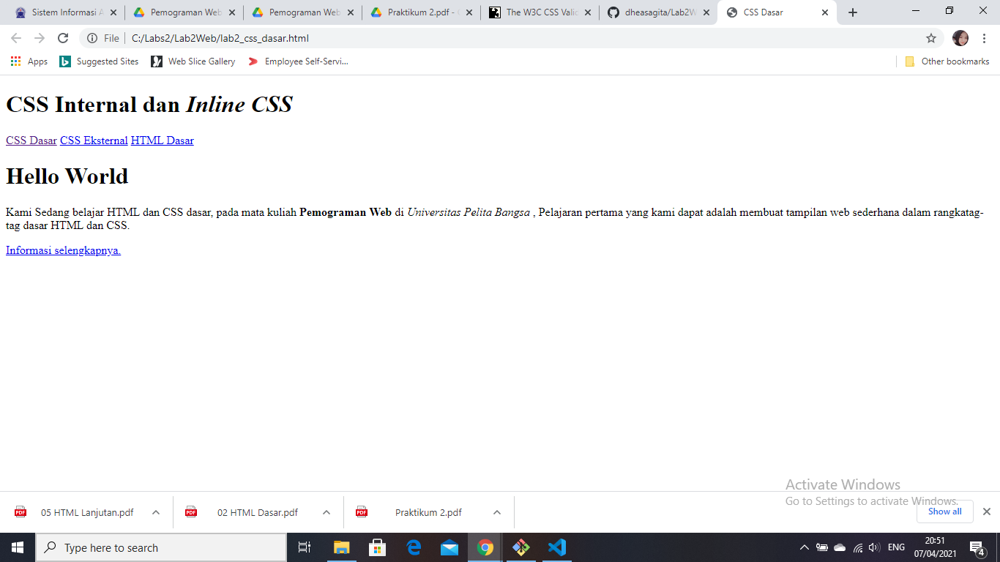
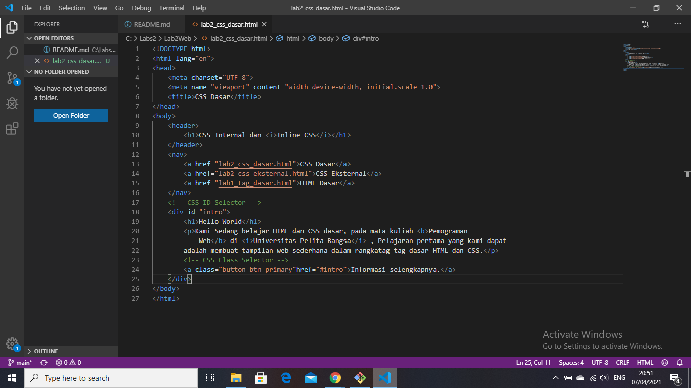

# Lab2Web
## Belajar CSS Dasar
### Menjawab Pertanyaan Tugas Praktikum 2
Nama : Dhea Sagita
NIM  : 311910123

1 Lakukan eksperimen dengan mengubah dan menambah properti dan nilai pada kode CSS
dengan mengacu pada CSS Cheat Sheet yang diberikan pada file terpisah dari modul ini.
Jawab : Sudah dan berhasil

2 Apa perbedaan pendeklarasian CSS elemen h1 {...} dengan #intro h1 {...}? berikan
penjelasannya!
Jawab : perbedaannya adalah elemen didalam h1 berisi {
            font-size: 24px;
            color: #0F189F;
            text-align: center;
            padding: 20px 10px;
        Sedangkan #intro h1 berisi
            text-align: left;
            border: 0;
            color: #fff;

3 Apabila ada deklarasi CSS secara internal, lalu ditambahkan CSS eksternal dan inline CSS pada
elemen yang sama. Deklarasi manakah yang akan ditampilkan pada browser? Berikan
penjelasan dan contohnya!
Jawab : Deklarasi dibagian background CSS eksternal akan berubah warna

4 Pada sebuah elemen HTML terdapat ID dan Class, apabila masing-masing selector tersebut
terdapat deklarasi CSS, maka deklarasi manakah yang akan ditampilkan pada browser?
Berikan penjelasan dan contohnya! ( < p id="paragraf-1" class="text-paragraf"> )
Jawab : Deklarasi keduanya dapat ditampilkan di web browser 

### Membuat Paragraf
kode tag untuk paragraf adalah '
'
ini adalah tampilannya

